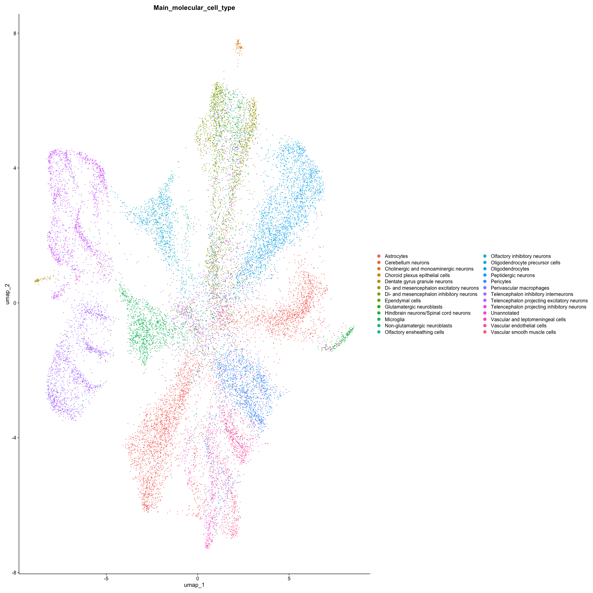
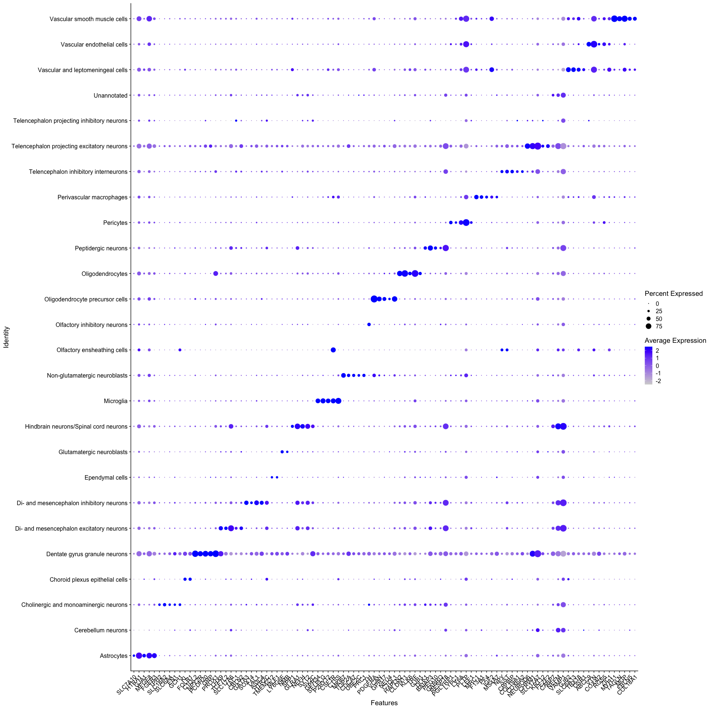

## Import libraries

    library(Seurat)

    ## Loading required package: SeuratObject

    ## Loading required package: sp

    ## 'SeuratObject' was built with package 'Matrix' 1.6.3 but the current
    ## version is 1.6.5; it is recomended that you reinstall 'SeuratObject' as
    ## the ABI for 'Matrix' may have changed

    ## 
    ## Attaching package: 'SeuratObject'

    ## The following object is masked from 'package:base':
    ## 
    ##     intersect

    library(SuperSpot)
    library(SuperCell)
    library(tidyr)
    library(tidyverse)

    ## ── Attaching core tidyverse packages ──────────────────────── tidyverse 2.0.0 ──
    ## ✔ dplyr     1.1.4     ✔ purrr     1.0.2
    ## ✔ forcats   1.0.0     ✔ readr     2.1.5
    ## ✔ ggplot2   3.4.4     ✔ stringr   1.5.1
    ## ✔ lubridate 1.9.3     ✔ tibble    3.2.1

    ## ── Conflicts ────────────────────────────────────────── tidyverse_conflicts() ──
    ## ✖ dplyr::filter() masks stats::filter()
    ## ✖ dplyr::lag()    masks stats::lag()
    ## ℹ Use the conflicted package (<http://conflicted.r-lib.org/>) to force all conflicts to become errors

    library(igraph)

    ## 
    ## Attaching package: 'igraph'
    ## 
    ## The following objects are masked from 'package:lubridate':
    ## 
    ##     %--%, union
    ## 
    ## The following objects are masked from 'package:dplyr':
    ## 
    ##     as_data_frame, groups, union
    ## 
    ## The following objects are masked from 'package:purrr':
    ## 
    ##     compose, simplify
    ## 
    ## The following object is masked from 'package:tibble':
    ## 
    ##     as_data_frame
    ## 
    ## The following object is masked from 'package:tidyr':
    ## 
    ##     crossing
    ## 
    ## The following object is masked from 'package:Seurat':
    ## 
    ##     components
    ## 
    ## The following objects are masked from 'package:stats':
    ## 
    ##     decompose, spectrum
    ## 
    ## The following object is masked from 'package:base':
    ## 
    ##     union

Download files from <https://zenodo.org/records/8327576>. You need
“well7\_5raw\_expression\_pd.csv”, “metadata.csv” and
“well7\_5\_spatial.csv”.

    wget https://zenodo.org/records/8327576/files/well7_5raw_expression_pd.csv
    wget https://zenodo.org/records/8327576/files/metadata.csv
    wget https://zenodo.org/records/8327576/files/well7_5_spatial.csv

## Import dataset

    well7.mtx <- read_csv("./well7_5raw_expression_pd.csv") %>% column_to_rownames("GENE")

    ## Rows: 1022 Columns: 44976
    ## ── Column specification ────────────────────────────────────────────────────────
    ## Delimiter: ","
    ## chr     (1): GENE
    ## dbl (44975): well7_5_0, well7_5_1, well7_5_2, well7_5_3, well7_5_4, well7_5_...
    ## 
    ## ℹ Use `spec()` to retrieve the full column specification for this data.
    ## ℹ Specify the column types or set `show_col_types = FALSE` to quiet this message.

    well7.mtx[1:5,1:5]

    ##        well7_5_0 well7_5_1 well7_5_2 well7_5_3 well7_5_4
    ## A2M            0         0         0         0         0
    ## ABCC9          0         0         0         0         0
    ## ABI3BP         0         0         0         0         0
    ## ACBD7          0         0         0         0         0
    ## ACTA2          0         0         0         0         0

    md <- read_csv("./metadata.csv")

    ## Rows: 1091281 Columns: 18
    ## ── Column specification ────────────────────────────────────────────────────────
    ## Delimiter: ","
    ## chr (18): NAME, biosample_id, donor_id, species, species__ontology_label, di...
    ## 
    ## ℹ Use `spec()` to retrieve the full column specification for this data.
    ## ℹ Specify the column types or set `show_col_types = FALSE` to quiet this message.

    md[1:5,1:5]

    ## # A tibble: 5 × 5
    ##   NAME        biosample_id donor_id species         species__ontology_label
    ##   <chr>       <chr>        <chr>    <chr>           <chr>                  
    ## 1 TYPE        group        group    group           group                  
    ## 2 sagittal3_0 1            A        NCBITaxon:10090 Mus musculus           
    ## 3 sagittal3_1 1            A        NCBITaxon:10090 Mus musculus           
    ## 4 sagittal3_2 1            A        NCBITaxon:10090 Mus musculus           
    ## 5 sagittal3_3 1            A        NCBITaxon:10090 Mus musculus

    well7.md <- md[md$NAME %in% colnames(well7.mtx) == T,]
    well7.md[1:5,1:5]

    ## # A tibble: 5 × 5
    ##   NAME      biosample_id donor_id species         species__ontology_label
    ##   <chr>     <chr>        <chr>    <chr>           <chr>                  
    ## 1 well7_5_0 15           C        NCBITaxon:10090 Mus musculus           
    ## 2 well7_5_1 15           C        NCBITaxon:10090 Mus musculus           
    ## 3 well7_5_2 15           C        NCBITaxon:10090 Mus musculus           
    ## 4 well7_5_3 15           C        NCBITaxon:10090 Mus musculus           
    ## 5 well7_5_4 15           C        NCBITaxon:10090 Mus musculus

    well7.spatial <- read_csv("./well7_5_spatial.csv")

    ## Rows: 44976 Columns: 9
    ## ── Column specification ────────────────────────────────────────────────────────
    ## Delimiter: ","
    ## chr (9): NAME, X, Y, Z, Main_molecular_cell_type, Sub_molecular_cell_type, M...
    ## 
    ## ℹ Use `spec()` to retrieve the full column specification for this data.
    ## ℹ Specify the column types or set `show_col_types = FALSE` to quiet this message.

    well7.spatial <- well7.spatial[-1,]

    spotPosition <- dplyr::select(well7.spatial,c("NAME","X","Y")) %>% column_to_rownames("NAME")
    colnames(spotPosition) <- c("imagerow","imagecol")

    spotPosition$imagerow <- as.numeric(spotPosition$imagerow)
    spotPosition$imagecol <- as.numeric(spotPosition$imagecol)
    spotPosition <- select(spotPosition,c("imagerow","imagecol"))

## Create metaspot object

The function “SCimplify\_SpatialDLS” uses the raw count matrix and the
spatial coordinates of the spots to build the metaspots. You can choose
to split or not the the connections between the spots that have a higher
distance compared to the other ones with “split\_not\_connected”. You
can also split the metaspots based on a provided annotation with
“cell.annotation” parameter (i.e.,metaspots containing spots from
different cell types/regions will be split resulting in one metaspot for
each cell type/region). The main output here is the membership given to
each spot to know in which metaspot it is assigned.

    g = 10 # gamma
    n.pc = 5 # number of first PC to use
    k.knn = 16 # number of neighbors to connect to each spot

    print("Creating metaspots")

    ## [1] "Creating metaspots"

    MC.well7_DLS <- SCimplify_SpatialDLS(X = well7.mtx ,
                                         spotPositions = spotPosition ,
                                         method_similarity = "1",
                                         split_not_connected = T,
                                         genes.use = rownames(well7.mtx),
                                         gamma = g,
                                         n.pc = n.pc,
                                         method_knn = "1",
                                         k.knn = k.knn,
                                         method_normalization = "log_normalize",
                                         cell.annotation = well7.md$Main_molecular_cell_type,)

    ## [1] "Building KNN graph with nn2"
    ## [1] "Neighbors with distance > 173.209634230687 are removed"

    ## [1] "Maximum gamma is 79.181338028169"
    ## [1] "Done"

    ## Warning: Data is of class data.frame. Coercing to dgCMatrix.

    ## [1] "Performing Log Normalization"

    ## Normalizing layer: counts

    ## [1] "Done"
    ## [1] "Running PCA"

    ## Finding variable features for layer counts

    ## Centering and scaling data matrix

    ## [1] "Done"
    ## [1] "Computing PCA dist for each edge"
    ## [1] "Done"
    ## [1] "Computing similarity from PCA distances"
    ## [1] "Done"
    ## [1] "Returning graph with PCA similarity as weight"
    ## [1] "Clustering"
    ## [1] "Done"

    print("Done")

    ## [1] "Done"

    well7.md[,str_c("MC_membership_",g)] <- MC.well7_DLS$membership %>% as.character()

The major quality control for metaspots is purity (proportion of the
most abundant cell type/region within each metaspot). In the case where
we decided to split the metaspots with the paramater “cell.annotation”,
the purity should be equal to 1.

    #We compute the purity for each metaspot
    method_purity <- c("max_proportion", "entropy")[1]
    MC.well7_DLS$purity <- supercell_purity(
      clusters = well7.md$Main_molecular_cell_type,
      supercell_membership = MC.well7_DLS$membership, 
      method = method_purity
    )

    print(str_c("mean purity is ",mean(MC.well7_DLS$purity)))

    ## [1] "mean purity is 1"

    #We assign each metaspot with its corresponding annotation
    MC.well7_DLS$Main_molecular_cell_type <- supercell_assign(clusters = well7.md$Main_molecular_cell_type,
                                                              supercell_membership = MC.well7_DLS$membership,
                                                              method = "absolute")

SuperSpot come with its own way to visualize the metapots. The function
“supercell\_metaspots\_shape” first builds the polygons representing the
metaspots covering the original spots.

    print("Creating polygons for visualization")

    ## [1] "Creating polygons for visualization"

    MC.well7_DLS$polygons <- supercell_metaspots_shape(MC = MC.well7_DLS,
                                                       spotpositions = spotPosition,
                                                       annotation = "Main_molecular_cell_type",
                                                       concavity = 2,
                                                       membership_name = "membership")
    print("Done")

    ## [1] "Done"

    SpatialDimPlotSC(original_coord = spotPosition,
                     MC = MC.well7_DLS,
                     sc.col = "Main_molecular_cell_type",
                     sc.col2 = str_c("MC_membership_",g),
                     polygons_col = "polygons",
                     meta_data = well7.md)+
      NoLegend()

Because we wanted that every metaspot contains only one cell type and we
split them, it created metaspots with gaps. To overcome this, we split
them again based on if they are still connected or not in the KNN.

    MC.well7_DLS.spl <- split_unconnected(MC.well7_DLS)
    well7.md[,str_c("MC_membership_spl_",g)] <- MC.well7_DLS.spl$membership %>%
      as.character()

    MC.well7_DLS.spl$Main_molecular_cell_type <- supercell_assign(clusters = well7.md$Main_molecular_cell_type,
                                                                  supercell_membership = MC.well7_DLS.spl$membership,
                                                                  method = "absolute")

    MC.well7_DLS.spl$polygons <- supercell_metaspots_shape(MC = MC.well7_DLS.spl,
                                                           spotpositions = spotPosition,
                                                           annotation = "Main_molecular_cell_type",
                                                           concavity = 2,membership_name = "membership")

    SpatialDimPlotSC(original_coord = spotPosition,
                     MC = MC.well7_DLS.spl,
                     sc.col = "Main_molecular_cell_type",
                     sc.col2 = str_c("MC_membership_spl_",g),
                     polygons_col = "polygons",
                     meta_data = well7.md)+
      NoLegend()+ 
      theme(plot.background = element_rect(fill = 'black'),
            panel.background = element_rect(fill = 'black'),
            panel.grid.major = element_blank(),
            panel.grid.minor = element_blank())

## Create Seurat object from metaspot object

    MC_centroids <- supercell_spatial_centroids(MC.well7_DLS.spl,spotPositions = spotPosition)

    MC.ge <- superspot_GE(MC = MC.well7_DLS.spl,
      ge = well7.mtx %>% as.matrix(),
      groups = as.numeric(MC.well7_DLS.spl$membership)
    )

    MC.seurat <- supercell_2_Seuratv5(
      SC.GE = MC.ge, 
      SC = MC.well7_DLS.spl, 
      fields = c("Main_molecular_cell_type")
    )

    ## Warning: Data is of class dgeMatrix. Coercing to dgCMatrix.

    MC.seurat <- NormalizeData(MC.seurat)

    ## Normalizing layer: counts

    MC.seurat <- ScaleData(MC.seurat)

    ## Centering and scaling data matrix

    MC.seurat <- FindVariableFeatures(MC.seurat)

    ## Finding variable features for layer counts

    MC.seurat <- RunPCA(MC.seurat)

    ## PC_ 1 
    ## Positive:  PLTP, SELPLG, MBP, VTN, ABCC9, SPARC, VIM, CSF1R, P2RY12, GPR34 
    ##     LEF1, LY6C1, TEK, RGS5, CTSS, APOD, LY6A, FN1, CLDN5, SLC7A10 
    ##     PGLYRP1, GFAP, VWF, FLT1, CST3, ZIC1, C1QB, MFSD2A, TREM2, S1PR1 
    ## Negative:  CPNE6, GRM7, GRM5, CACNA2D1, SEZ6, PGR, CHRM1, IGSF8, OPRL1, RESP18 
    ##     GPRASP2, ATP2B4, PRKCG, STMN2, SLC24A2, SPHKAP, GABBR2, C1QL3, NEUROD6, PTPN3 
    ##     LTK, KCND3, KCNG1, PPP2R2B, NPTX1, LRPPRC, NEUROD2, CCK, CADM1, SUMO2 
    ## PC_ 2 
    ## Positive:  TRF, APOD, CLDN11, MAL, HAPLN2, PPP1R14A, TMEM88B, MOG, UGT8A, CAR2 
    ##     MBP, OPALIN, PTGDS, KLK6, ANLN, PRR5L, PLIN3, GJB1, SERPINB1A, PROX1 
    ##     SPARC, EFHD1, CCP110, TBX20, ST18, CD9, DOCK5, UNC5B, HHIP, SLC6A5 
    ## Negative:  NRGN, SLC17A7, CHRM1, CCK, ADCY1, PRKCG, GRM5, CPNE6, C1QL3, NPTX1 
    ##     HPCAL4, NECAB1, TBR1, RGS4, CACNA2D1, NEUROD6, TIAM1, NEUROD2, PDE1A, SLC30A3 
    ##     ATP2B4, DBPHT2, KCNG1, SPHKAP, SEZ6, CRYM, NPY1R, LAMP5, MCHR1, DKK3 
    ## PC_ 3 
    ## Positive:  VIM, MFGE8, GFAP, SLC1A3, PLTP, VTN, DCN, MGP, GJB2, IGF2 
    ##     S1PR1, MYOC, LHX2, FN1, TBX18, SLC6A13, MYH11, VWF, HOPX, NR2F2 
    ##     FJX1, SLC17A7, COL3A1, GRIN2C, GLDC, FAM107A, AQP4, HTRA1, HPCAL4, CST3 
    ## Negative:  VAMP1, GLRA1, RESP18, SYT2, GPRASP2, SLC32A1, GAD1, GAD2, MBP, NEFM 
    ##     CACNA2D2, KCNC3, HTR2C, KCNC2, CORO6, SLC24A2, OPRL1, STMN2, PVALB, SLC17A6 
    ##     RGS8, PLCXD2, SV2C, GATA3, NEFH, MRAP2, BAIAP3, GNG4, LGI2, HAP1 
    ## PC_ 4 
    ## Positive:  HTRA1, SLC6A11, FGFR3, S1PR1, CLU, SLC1A3, MFGE8, AQP4, TTYH1, PTPRZ1 
    ##     MLC1, NTSR2, GJA1, CBS, ADCYAP1R1, FJX1, SLC7A10, FAM107A, CXCL14, CLDN10 
    ##     AGT, CST3, ID4, FAM181B, NDRG2, ADA, CSPG5, TIMP4, GLDC, GRIN2C 
    ## Negative:  APOD, HAPLN2, TRF, CLDN11, PPP1R14A, MAL, KLK6, ANLN, UGT8A, MGP 
    ##     GJB1, VTN, PTGDS, IGF2, PRR5L, OPALIN, PDLIM1, SERPINB1A, MOG, TBX20 
    ##     TBX18, DCN, TMEM88B, UNC5B, TMSB4X, PTPRK, TMEM215, CCP110, DOCK5, DPY19L1 
    ## PC_ 5 
    ## Positive:  SLC17A7, HAPLN2, CLDN11, MOG, CAR2, OPALIN, HPCAL4, TRF, NRGN, UGT8A 
    ##     TMEM88B, GJB1, ANLN, SERPINB1A, C1QL3, PRKCG, TBR1, PPP1R14A, DPY19L1, CRYM 
    ##     CHRM1, CCP110, TCF4, CCK, NEUROD6, FEZF2, PRR5L, MAL, PROX1, ADCY1 
    ## Negative:  IGF2, VTN, MGP, GJB2, TBX18, SLC6A13, MYH11, GLRA1, ZIC1, PLTP 
    ##     SERPINF1, SYT2, VIM, ISLR, SPP1, COL3A1, FN1, VWF, VAMP1, TAGLN 
    ##     SPARC, FBLN5, A2M, CSRP2, SLC47A1, SLC13A3, MYOC, COL18A1, IGFBP4, ASS1

    MC.seurat <- RunUMAP(MC.seurat, dims = 1:30)

    ## Warning: The default method for RunUMAP has changed from calling Python UMAP via reticulate to the R-native UWOT using the cosine metric
    ## To use Python UMAP via reticulate, set umap.method to 'umap-learn' and metric to 'correlation'
    ## This message will be shown once per session

    ## 16:30:07 UMAP embedding parameters a = 0.9922 b = 1.112

    ## Found more than one class "dist" in cache; using the first, from namespace 'spam'

    ## Also defined by 'BiocGenerics'

    ## 16:30:07 Read 20135 rows and found 30 numeric columns

    ## 16:30:07 Using Annoy for neighbor search, n_neighbors = 30

    ## Found more than one class "dist" in cache; using the first, from namespace 'spam'

    ## Also defined by 'BiocGenerics'

    ## 16:30:07 Building Annoy index with metric = cosine, n_trees = 50

    ## 0%   10   20   30   40   50   60   70   80   90   100%

    ## [----|----|----|----|----|----|----|----|----|----|

    ## **************************************************|
    ## 16:30:08 Writing NN index file to temp file /var/folders/d6/8nyzvqcx6559qg6cqv9tkxc40000gn/T//Rtmpz59SQi/filef407162ca564
    ## 16:30:08 Searching Annoy index using 1 thread, search_k = 3000
    ## 16:30:12 Annoy recall = 100%
    ## 16:30:12 Commencing smooth kNN distance calibration using 1 thread with target n_neighbors = 30
    ## 16:30:13 Initializing from normalized Laplacian + noise (using RSpectra)
    ## 16:30:13 Commencing optimization for 200 epochs, with 924040 positive edges
    ## 16:30:19 Optimization finished

    DimPlot(MC.seurat, reduction = "umap", group.by = "Main_molecular_cell_type")

## Perform downstream analyses

    Idents(MC.seurat) <- "Main_molecular_cell_type" 
    levels(MC.seurat) <- sort(levels(MC.seurat))

    VlnPlot(MC.seurat,"nFeature_RNA")+NoLegend()

    #Compute marker genes
    well7.mc.markers <-  FindAllMarkers(MC.seurat,
                                        only.pos = TRUE,
                                        min.pct = 0.25,
                                        logfc.threshold = 0.25 ) %>%
      filter(p_val_adj < 0.05)

    ## Calculating cluster Astrocytes

    ## For a (much!) faster implementation of the Wilcoxon Rank Sum Test,
    ## (default method for FindMarkers) please install the presto package
    ## --------------------------------------------
    ## install.packages('devtools')
    ## devtools::install_github('immunogenomics/presto')
    ## --------------------------------------------
    ## After installation of presto, Seurat will automatically use the more 
    ## efficient implementation (no further action necessary).
    ## This message will be shown once per session

    ## Calculating cluster Cerebellum neurons

    ## Calculating cluster Cholinergic and monoaminergic neurons

    ## Calculating cluster Choroid plexus epithelial cells

    ## Calculating cluster Dentate gyrus granule neurons

    ## Calculating cluster Di- and mesencephalon excitatory neurons

    ## Calculating cluster Di- and mesencephalon inhibitory neurons

    ## Calculating cluster Ependymal cells

    ## Calculating cluster Glutamatergic neuroblasts

    ## Calculating cluster Hindbrain neurons/Spinal cord neurons

    ## Calculating cluster Microglia

    ## Calculating cluster Non-glutamatergic neuroblasts

    ## Calculating cluster Olfactory ensheathing cells

    ## Calculating cluster Olfactory inhibitory neurons

    ## Calculating cluster Oligodendrocyte precursor cells

    ## Calculating cluster Oligodendrocytes

    ## Calculating cluster Peptidergic neurons

    ## Calculating cluster Pericytes

    ## Calculating cluster Perivascular macrophages

    ## Calculating cluster Telencephalon inhibitory interneurons

    ## Calculating cluster Telencephalon projecting excitatory neurons

    ## Calculating cluster Telencephalon projecting inhibitory neurons

    ## Calculating cluster Unannotated

    ## Calculating cluster Vascular and leptomeningeal cells

    ## Calculating cluster Vascular endothelial cells

    ## Calculating cluster Vascular smooth muscle cells

    well7.mc.top.markers <- well7.mc.markers %>%
       group_by(cluster) %>%
        slice_max(n = 5, order_by = avg_log2FC)

    DotPlot(MC.seurat,features = well7.mc.top.markers$gene %>% unique()) + RotatedAxis()

