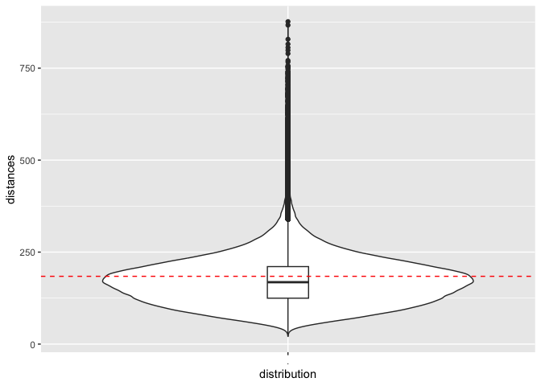
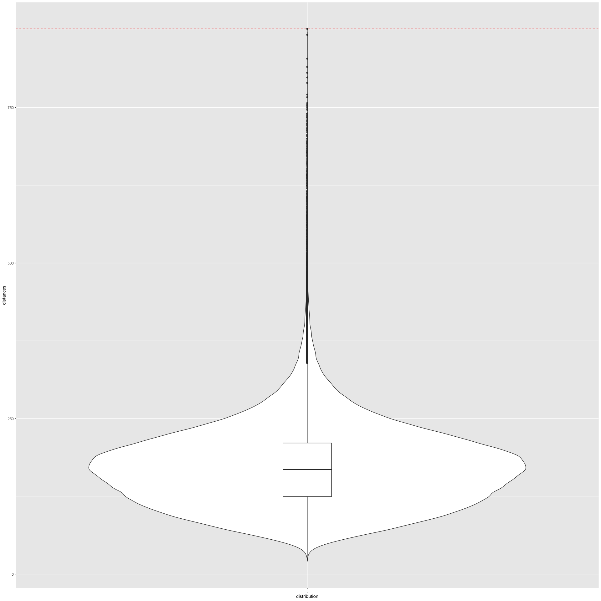
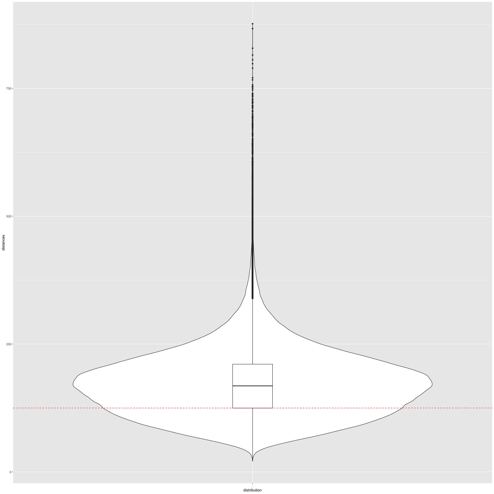
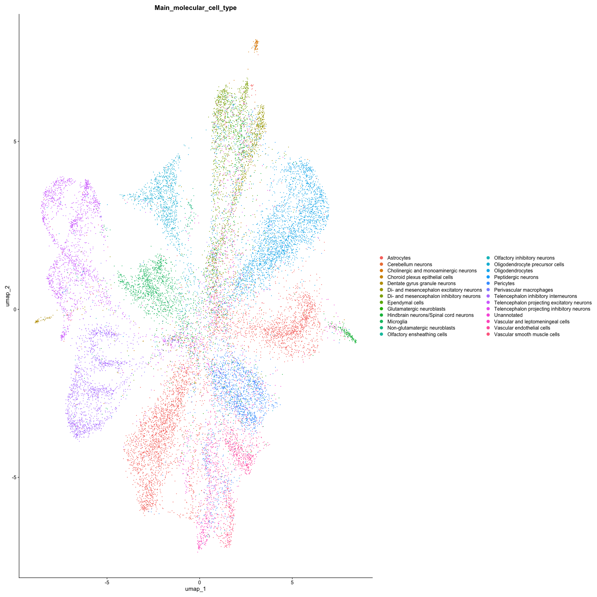
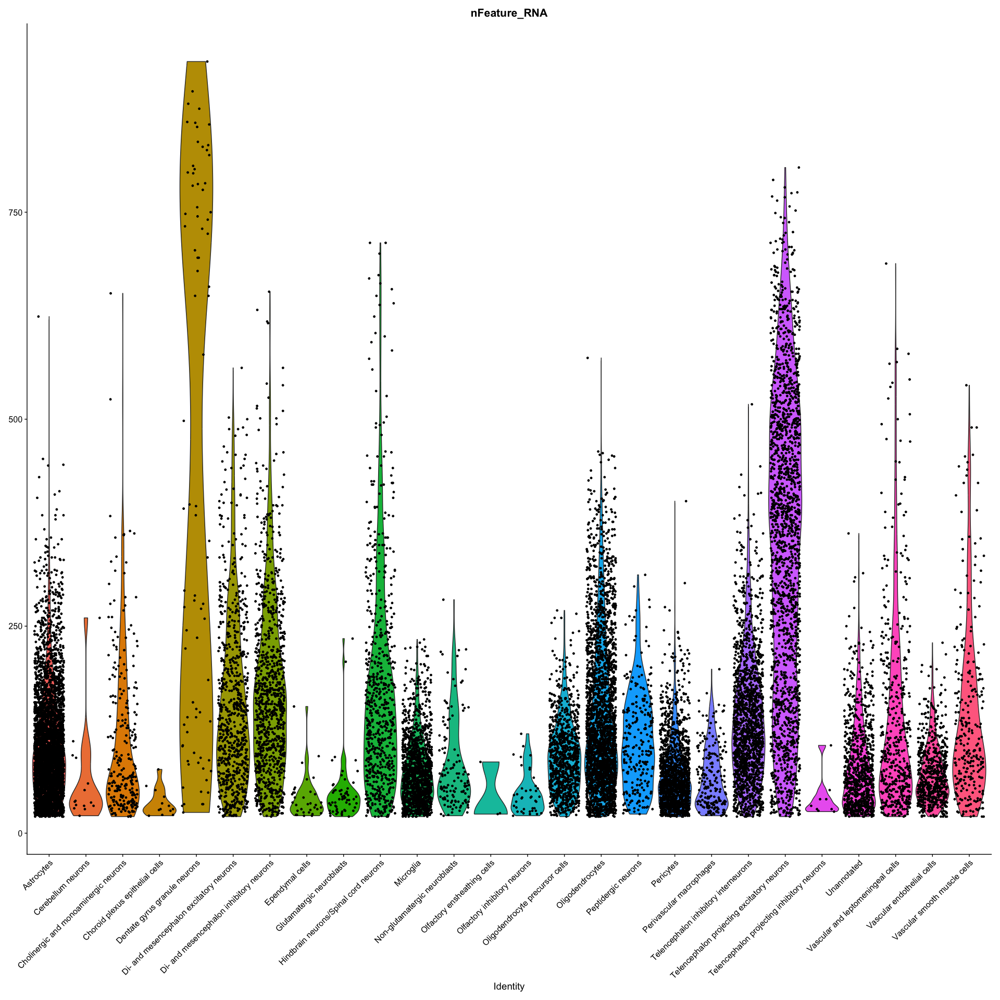
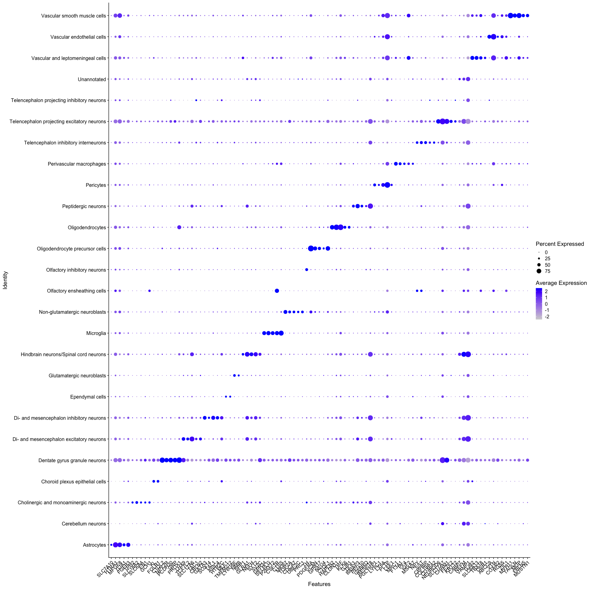

## Import libraries

``` r
library(Seurat)
```

    ## Loading required package: SeuratObject

    ## Loading required package: sp

    ## 'SeuratObject' was built under R 4.4.0 but the current version is
    ## 4.4.1; it is recomended that you reinstall 'SeuratObject' as the ABI
    ## for R may have changed

    ## 
    ## Attaching package: 'SeuratObject'

    ## The following objects are masked from 'package:base':
    ## 
    ##     intersect, t

``` r
library(SuperSpot)
library(SuperCell)
library(tidyr)
library(tidyverse)
```

    ## ── Attaching core tidyverse packages ──────────────────────── tidyverse 2.0.0 ──
    ## ✔ dplyr     1.1.4     ✔ purrr     1.0.2
    ## ✔ forcats   1.0.0     ✔ readr     2.1.5
    ## ✔ ggplot2   3.5.1     ✔ stringr   1.5.1
    ## ✔ lubridate 1.9.3     ✔ tibble    3.2.1

    ## ── Conflicts ────────────────────────────────────────── tidyverse_conflicts() ──
    ## ✖ dplyr::filter() masks stats::filter()
    ## ✖ dplyr::lag()    masks stats::lag()
    ## ℹ Use the conflicted package (<http://conflicted.r-lib.org/>) to force all conflicts to become errors

``` r
library(igraph)
```

    ## 
    ## Attaching package: 'igraph'
    ## 
    ## The following objects are masked from 'package:lubridate':
    ## 
    ##     %--%, union
    ## 
    ## The following objects are masked from 'package:dplyr':
    ## 
    ##     as_data_frame, groups, union
    ## 
    ## The following objects are masked from 'package:purrr':
    ## 
    ##     compose, simplify
    ## 
    ## The following object is masked from 'package:tibble':
    ## 
    ##     as_data_frame
    ## 
    ## The following object is masked from 'package:tidyr':
    ## 
    ##     crossing
    ## 
    ## The following object is masked from 'package:Seurat':
    ## 
    ##     components
    ## 
    ## The following objects are masked from 'package:stats':
    ## 
    ##     decompose, spectrum
    ## 
    ## The following object is masked from 'package:base':
    ## 
    ##     union

Download files from <https://zenodo.org/records/8327576>. You need
“well7_5raw_expression_pd.csv”, “metadata.csv” and
“well7_5_spatial.csv”.

``` bash
wget https://zenodo.org/records/8327576/files/well7_5raw_expression_pd.csv
wget https://zenodo.org/records/8327576/files/metadata.csv
wget https://zenodo.org/records/8327576/files/well7_5_spatial.csv
```

## Import dataset

``` r
well7.mtx <- read_csv("./well7_5raw_expression_pd.csv") %>% column_to_rownames("GENE") %>% as.sparse()
```

    ## Rows: 1022 Columns: 44976
    ## ── Column specification ────────────────────────────────────────────────────────
    ## Delimiter: ","
    ## chr     (1): GENE
    ## dbl (44975): well7_5_0, well7_5_1, well7_5_2, well7_5_3, well7_5_4, well7_5_...
    ## 
    ## ℹ Use `spec()` to retrieve the full column specification for this data.
    ## ℹ Specify the column types or set `show_col_types = FALSE` to quiet this message.

``` r
well7.mtx[1:5,1:5]
```

    ## 5 x 5 sparse Matrix of class "dgCMatrix"
    ##        well7_5_0 well7_5_1 well7_5_2 well7_5_3 well7_5_4
    ## A2M            .         .         .         .         .
    ## ABCC9          .         .         .         .         .
    ## ABI3BP         .         .         .         .         .
    ## ACBD7          .         .         .         .         .
    ## ACTA2          .         .         .         .         .

``` r
md <- read_csv("./metadata.csv")
```

    ## Rows: 1091281 Columns: 18
    ## ── Column specification ────────────────────────────────────────────────────────
    ## Delimiter: ","
    ## chr (18): NAME, biosample_id, donor_id, species, species__ontology_label, di...
    ## 
    ## ℹ Use `spec()` to retrieve the full column specification for this data.
    ## ℹ Specify the column types or set `show_col_types = FALSE` to quiet this message.

``` r
md[1:5,1:5]
```

    ## # A tibble: 5 × 5
    ##   NAME        biosample_id donor_id species         species__ontology_label
    ##   <chr>       <chr>        <chr>    <chr>           <chr>                  
    ## 1 TYPE        group        group    group           group                  
    ## 2 sagittal3_0 1            A        NCBITaxon:10090 Mus musculus           
    ## 3 sagittal3_1 1            A        NCBITaxon:10090 Mus musculus           
    ## 4 sagittal3_2 1            A        NCBITaxon:10090 Mus musculus           
    ## 5 sagittal3_3 1            A        NCBITaxon:10090 Mus musculus

``` r
well7.md <- md[md$NAME %in% colnames(well7.mtx) == T,]
well7.md[1:5,1:5]
```

    ## # A tibble: 5 × 5
    ##   NAME      biosample_id donor_id species         species__ontology_label
    ##   <chr>     <chr>        <chr>    <chr>           <chr>                  
    ## 1 well7_5_0 15           C        NCBITaxon:10090 Mus musculus           
    ## 2 well7_5_1 15           C        NCBITaxon:10090 Mus musculus           
    ## 3 well7_5_2 15           C        NCBITaxon:10090 Mus musculus           
    ## 4 well7_5_3 15           C        NCBITaxon:10090 Mus musculus           
    ## 5 well7_5_4 15           C        NCBITaxon:10090 Mus musculus

``` r
well7.spatial <- read_csv("./well7_5_spatial.csv")
```

    ## Rows: 44976 Columns: 9
    ## ── Column specification ────────────────────────────────────────────────────────
    ## Delimiter: ","
    ## chr (9): NAME, X, Y, Z, Main_molecular_cell_type, Sub_molecular_cell_type, M...
    ## 
    ## ℹ Use `spec()` to retrieve the full column specification for this data.
    ## ℹ Specify the column types or set `show_col_types = FALSE` to quiet this message.

``` r
well7.spatial <- well7.spatial[-1,]

spotPosition <- dplyr::select(well7.spatial,c("NAME","X","Y")) %>% column_to_rownames("NAME")
#colnames(spotPosition) <- c("imagerow","imagecol")

spotPosition$X <- as.numeric(spotPosition$X)
spotPosition$Y <- as.numeric(spotPosition$Y)
#spotPosition <- select(spotPosition,c("imagerow","imagecol"))
```

## Create metaspot object

The function “SCimplify_SpatialDLS” uses the raw count matrix and the
spatial coordinates of the spots to build the metaspots. You can choose
to split or not the the connections between the spots that have a higher
distance compared to the other ones with “split_not_connected”. You can
also split the metaspots based on a provided annotation with
“cell.annotation” parameter (i.e.,metaspots containing spots from
different cell types/regions will be split resulting in one metaspot for
each cell type/region). The main output here is the membership given to
each spot to know in which metaspot it is assigned.

``` r
g = 10 # gamma
n.pc = 1:5 # number of first PC to use
k.knn = 15 # number of neighbors to connect to each spot

print("Creating metaspots")
```

    ## [1] "Creating metaspots"

``` r
# By default, SCimplify_SpatialDLS computes distances in a parallalized way. By default, all the available cpus are used. If your computer doesn't support, you can change the number of cpus with the paramater "n.cpu"
MC.well7 <- SCimplify_SpatialDLS_v2(X = well7.mtx ,
                                     spotPositions = spotPosition ,
                                    col.x = "X",
                                    col.y = "Y",
                                     method_similarity = "1",
                                     split_not_connected = TRUE,
                                     method_reduction = "PCA",
                                     gamma = g,
                                     n.dim = n.pc,
                                     method_knn = "1",
                                     k.knn = k.knn,
                                     method_normalization = "log_normalize",
                                     cell.annotation = well7.md$Main_molecular_cell_type)
```

    ## Building KNN graph with nn2

    ## Neighbors with distance > 184.243244200001 are removed



    ## Maximum gamma is 117.42819843342

    ## Done

    ## Performing Log Normalization

    ## Normalizing layer: counts

    ## Done

    ## Finding variable features for layer counts

    ## Centering and scaling data matrix

    ## Running PCA

    ## PC_ 1 
    ## Positive:  GRM5, SLC17A7, PRKCG, CPNE6, NRGN, CADM1, CCK, NPTX1, CACNA2D1, C1QL3 
    ##     ATP2B4, PDE1A, IGSF8, ADCY1, GABBR1, SEZ6, CHRM1, GRM7, GPRASP2, STMN2 
    ##     SPHKAP, RESP18, CADM2, SUMO2, RGS4, PGR, KCND3, NEUROD2, GABBR2, LMO3 
    ## Negative:  APOD, PTGDS, TRF, MBP, MAL, CLDN11, SPARC, PPP1R14A, CAR2, TMEM88B 
    ##     VIM, MOG, GFAP, PLTP, HAPLN2, VTN, UGT8A, OPALIN, PLIN3, CD9 
    ##     AQP4, PRR5L, GJB2, IGF2, ANLN, CST3, HTRA1, NDRG2, S1PR1, KLK6 
    ## PC_ 2 
    ## Positive:  SLC17A7, NRGN, CCK, PDE1A, C1QL3, NPTX1, CHRM1, PRKCG, SATB2, TBR1 
    ##     ADCY1, ATP2B4, HPCAL4, RASL10A, CPNE6, DKK3, CACNA2D1, RGS4, NEUROD6, NEUROD2 
    ##     SLC30A3, CRYM, GRM5, NPY1R, NECAB1, CCKBR, BHLHE22, JUNB, CAR4, TIAM1 
    ## Negative:  MBP, TRF, TMEM88B, CAR2, CLDN11, MOG, SPARC, MAL, HAPLN2, PPP1R14A 
    ##     APOD, UGT8A, SLC6A11, NDRG2, GLRA1, PTGDS, OPALIN, VAMP1, CCP110, SYT2 
    ##     PLIN3, KLK6, ANLN, AQP4, SLC32A1, APLN, CACNA2D2, KIF5B, PRR5L, SERPINB1A 
    ## PC_ 3 
    ## Positive:  MFGE8, S1PR1, HTRA1, SLC1A3, VIM, AQP4, PLTP, FGFR3, VTN, GJB2 
    ##     CLU, CST3, IGF2, ID4, GJA1, FJX1, MLC1, NTSR2, PTPRZ1, MGP 
    ##     FAM107A, CBS, GRIN2C, FN1, TTYH1, CLDN10, SLC6A13, MYH11, SLC13A3, GFAP 
    ## Negative:  CLDN11, TRF, HAPLN2, TMEM88B, MOG, MAL, PPP1R14A, OPALIN, UGT8A, CCP110 
    ##     ANLN, GJB1, MBP, CAR2, SERPINB1A, PROX1, PRR5L, SLC24A2, KLK6, DPY19L1 
    ##     APOD, TBX20, UNC5B, ST18, SEMA4D, TMSB4X, EFHD1, GRM7, GRPR, SLC6A5 
    ## PC_ 4 
    ## Positive:  APOD, DCN, IGF2, VTN, MGP, VIM, GJB2, PPP1R14A, CLDN11, PTGDS 
    ##     MAL, PDE1A, SLC6A13, TRF, HAPLN2, KLK6, TBX18, GFAP, MYH11, ANLN 
    ##     UGT8A, PROX1, C1QL3, COL6A1, CRYM, SLC13A3, PDLIM1, PRR5L, MOG, OSR1 
    ## Negative:  VAMP1, GLRA1, SLC32A1, GAD1, SLC6A11, GAD2, SYT2, RESP18, NEFM, KCNC2 
    ##     GPRASP2, SLC17A6, CACNA2D2, PVALB, KCNC3, PLCXD2, NEFH, CLU, CORO6, HTR2C 
    ##     RGS8, MBP, ADCYAP1R1, MRAP2, CABP7, GATA3, SST, GNG4, LGI2, GABBR1 
    ## PC_ 5 
    ## Positive:  SLC1A3, MFGE8, TTYH1, CLU, S1PR1, HTRA1, FGFR3, FAM107A, PTPRZ1, MLC1 
    ##     CST3, NTSR2, CBS, AQP4, SLC6A11, CAR2, HPCAL4, FJX1, GJA1, NDRG2 
    ##     CXCL14, SLC17A7, GLDC, TCF4, CSPG5, HOPX, GRM3, SLC7A10, ID2, ID4 
    ## Negative:  IGF2, VTN, MGP, SLC6A13, GJB2, GLRA1, SYT2, TBX18, VAMP1, MYH11 
    ##     SPP1, IGFBP4, RESP18, GAD1, GAD2, ZIC1, ISLR, PVALB, SLC47A1, SLC13A3 
    ##     CSRP2, TAC1, KCNC3, FN1, COL3A1, CACNA2D2, GPRASP2, SLC32A1, SERPINF1, FBLN5

    ## Done

    ## Computing distance for each edge

    ## Done

    ## Computing similarity from distances

    ## Done

    ## Returning graph with similarity as weight

    ## Clustering

    ## Done

``` r
print("Done")
```

    ## [1] "Done"

``` r
well7.md[,str_c("MC_membership_",g)] <- MC.well7$membership %>% as.character()
```

The major quality control for metaspots is purity (proportion of the
most abundant cell type/region within each metaspot). In the case where
we decided to split the metaspots with the paramater “cell.annotation”,
the purity should be equal to 1.

``` r
#We compute the purity for each metaspot
method_purity <- c("max_proportion", "entropy")[1]
MC.well7$purity <- supercell_purity(
  clusters = well7.md$Main_molecular_cell_type,
  supercell_membership = MC.well7$membership, 
  method = method_purity
)


print(str_c("mean purity is ",mean(MC.well7$purity)))
```

    ## [1] "mean purity is 1"

``` r
#We assign each metaspot with its corresponding annotation
MC.well7$Main_molecular_cell_type <- supercell_assign(clusters = well7.md$Main_molecular_cell_type,
                                                          supercell_membership = MC.well7$membership,
                                                          method = "absolute")
```

SuperSpot come with its own way to visualize the metapots. The function
“supercell_metaspots_shape” first builds the polygons representing the
metaspots covering the original spots.

``` r
MC.well7$polygons <- supercell_metaspots_shape_v2(MC = MC.well7,
                                                   spotpositions = spotPosition,
                                                   annotation = "Main_molecular_cell_type",
                                                   concavity = 2,
                                                   membership_name = "membership")
```

    ## Creating polygons for visualization

    ## Done

``` r
SpatialDimPlotSC(original_coord = spotPosition,
                 col.x = "Y",
                 col.y = "X",
                 MC = MC.well7,
                 sc.col = "Main_molecular_cell_type",
                 sc.col2 = str_c("MC_membership_",g),
                 polygons_col = "polygons",
                 meta_data = well7.md)+
  coord_fixed()+
  theme_minimal()+
  NoLegend()
```


Because we wanted that every metaspot contains only one cell type and we
split them, it created metaspots with gaps. To overcome this, we split
them again based on if they are still connected or not in the KNN.

``` r
MC.well7.spl <- split_unconnected(MC.well7)
well7.md[,str_c("MC_membership_spl_",g)] <- MC.well7.spl$membership %>%
  as.character()

MC.well7.spl$Main_molecular_cell_type <- supercell_assign(clusters = well7.md$Main_molecular_cell_type,
                                                              supercell_membership = MC.well7.spl$membership,
                                                              method = "absolute")

MC.well7.spl$polygons <- supercell_metaspots_shape_v2(MC = MC.well7.spl,
                                                       spotpositions = spotPosition,
                                                       annotation = "Main_molecular_cell_type",
                                                       concavity = 2,membership_name = "membership")
```

    ## Creating polygons for visualization

    ## Done

``` r
SpatialDimPlotSC(original_coord = spotPosition,
                 col.x = "Y",
                 col.y = "X",
                 MC = MC.well7.spl,
                 sc.col = "Main_molecular_cell_type",
                 sc.col2 = str_c("MC_membership_spl_",g),
                 polygons_col = "polygons",
                 meta_data = well7.md)+
  coord_fixed()+
  theme_minimal()+
  NoLegend()
```


## Computing Metaspots without threshold on the KNN

We set the percentage to keep at 1:

``` r
g = 10 # gamma
n.pc = 1:5 # number of first PC to use
k.knn = 15 # number of neighbors to connect to each spot
pct = 1 # percentage of connections to keep

print("Creating metaspots")
```

    ## [1] "Creating metaspots"

``` r
# By default, SCimplify_SpatialDLS computes distances in a parallalized way. By default, all the available cpus are used. If your computer doesn't support, you can change the number of cpus with the paramater "n.cpu"
MC.well7_no_tresh <- SCimplify_SpatialDLS_v2(X = well7.mtx ,
                                     spotPositions = spotPosition ,
                                     col.x = "X",
                                     col.y = "Y",
                                     method_similarity = "1",
                                     split_not_connected = TRUE,
                                     method_reduction = "PCA",
                                     gamma = g,
                                     n.dim = n.pc,
                                     method_knn = "1",
                                     k.knn = k.knn,
                                     pct = pct,
                                     method_normalization = "log_normalize",
                                     cell.annotation = well7.md$Main_molecular_cell_type)
```

    ## Building KNN graph with nn2

    ## Neighbors with distance > 876.432419316108 are removed



    ## Maximum gamma is 44975

    ## Done

    ## Performing Log Normalization

    ## Normalizing layer: counts

    ## Done

    ## Finding variable features for layer counts

    ## Centering and scaling data matrix

    ## Running PCA

    ## PC_ 1 
    ## Positive:  GRM5, SLC17A7, PRKCG, CPNE6, NRGN, CADM1, CCK, NPTX1, CACNA2D1, C1QL3 
    ##     ATP2B4, PDE1A, IGSF8, ADCY1, GABBR1, SEZ6, CHRM1, GRM7, GPRASP2, STMN2 
    ##     SPHKAP, RESP18, CADM2, SUMO2, RGS4, PGR, KCND3, NEUROD2, GABBR2, LMO3 
    ## Negative:  APOD, PTGDS, TRF, MBP, MAL, CLDN11, SPARC, PPP1R14A, CAR2, TMEM88B 
    ##     VIM, MOG, GFAP, PLTP, HAPLN2, VTN, UGT8A, OPALIN, PLIN3, CD9 
    ##     AQP4, PRR5L, GJB2, IGF2, ANLN, CST3, HTRA1, NDRG2, S1PR1, KLK6 
    ## PC_ 2 
    ## Positive:  SLC17A7, NRGN, CCK, PDE1A, C1QL3, NPTX1, CHRM1, PRKCG, SATB2, TBR1 
    ##     ADCY1, ATP2B4, HPCAL4, RASL10A, CPNE6, DKK3, CACNA2D1, RGS4, NEUROD6, NEUROD2 
    ##     SLC30A3, CRYM, GRM5, NPY1R, NECAB1, CCKBR, BHLHE22, JUNB, CAR4, TIAM1 
    ## Negative:  MBP, TRF, TMEM88B, CAR2, CLDN11, MOG, SPARC, MAL, HAPLN2, PPP1R14A 
    ##     APOD, UGT8A, SLC6A11, NDRG2, GLRA1, PTGDS, OPALIN, VAMP1, CCP110, SYT2 
    ##     PLIN3, KLK6, ANLN, AQP4, SLC32A1, APLN, CACNA2D2, KIF5B, PRR5L, SERPINB1A 
    ## PC_ 3 
    ## Positive:  MFGE8, S1PR1, HTRA1, SLC1A3, VIM, AQP4, PLTP, FGFR3, VTN, GJB2 
    ##     CLU, CST3, IGF2, ID4, GJA1, FJX1, MLC1, NTSR2, PTPRZ1, MGP 
    ##     FAM107A, CBS, GRIN2C, FN1, TTYH1, CLDN10, SLC6A13, MYH11, SLC13A3, GFAP 
    ## Negative:  CLDN11, TRF, HAPLN2, TMEM88B, MOG, MAL, PPP1R14A, OPALIN, UGT8A, CCP110 
    ##     ANLN, GJB1, MBP, CAR2, SERPINB1A, PROX1, PRR5L, SLC24A2, KLK6, DPY19L1 
    ##     APOD, TBX20, UNC5B, ST18, SEMA4D, TMSB4X, EFHD1, GRM7, GRPR, SLC6A5 
    ## PC_ 4 
    ## Positive:  APOD, DCN, IGF2, VTN, MGP, VIM, GJB2, PPP1R14A, CLDN11, PTGDS 
    ##     MAL, PDE1A, SLC6A13, TRF, HAPLN2, KLK6, TBX18, GFAP, MYH11, ANLN 
    ##     UGT8A, PROX1, C1QL3, COL6A1, CRYM, SLC13A3, PDLIM1, PRR5L, MOG, OSR1 
    ## Negative:  VAMP1, GLRA1, SLC32A1, GAD1, SLC6A11, GAD2, SYT2, RESP18, NEFM, KCNC2 
    ##     GPRASP2, SLC17A6, CACNA2D2, PVALB, KCNC3, PLCXD2, NEFH, CLU, CORO6, HTR2C 
    ##     RGS8, MBP, ADCYAP1R1, MRAP2, CABP7, GATA3, SST, GNG4, LGI2, GABBR1 
    ## PC_ 5 
    ## Positive:  SLC1A3, MFGE8, TTYH1, CLU, S1PR1, HTRA1, FGFR3, FAM107A, PTPRZ1, MLC1 
    ##     CST3, NTSR2, CBS, AQP4, SLC6A11, CAR2, HPCAL4, FJX1, GJA1, NDRG2 
    ##     CXCL14, SLC17A7, GLDC, TCF4, CSPG5, HOPX, GRM3, SLC7A10, ID2, ID4 
    ## Negative:  IGF2, VTN, MGP, SLC6A13, GJB2, GLRA1, SYT2, TBX18, VAMP1, MYH11 
    ##     SPP1, IGFBP4, RESP18, GAD1, GAD2, ZIC1, ISLR, PVALB, SLC47A1, SLC13A3 
    ##     CSRP2, TAC1, KCNC3, FN1, COL3A1, CACNA2D2, GPRASP2, SLC32A1, SERPINF1, FBLN5

    ## Done

    ## Computing distance for each edge

    ## Done

    ## Computing similarity from distances

    ## Done

    ## Returning graph with similarity as weight

    ## Clustering

    ## Done

``` r
print("Done")
```

    ## [1] "Done"

``` r
well7.md[,str_c("MC_membership_no_tresh_",g)] <- MC.well7_no_tresh$membership %>% as.character()

MC.well7_no_tresh.spl <- split_unconnected(MC.well7_no_tresh)
well7.md[,str_c("MC_membership_no_tresh_spl_",g)] <- MC.well7_no_tresh.spl$membership %>%
  as.character()

MC.well7_no_tresh.spl$Main_molecular_cell_type <- supercell_assign(clusters = well7.md$Main_molecular_cell_type,
                                                              supercell_membership = MC.well7_no_tresh.spl$membership,
                                                              method = "absolute")

MC.well7_no_tresh.spl$polygons <- supercell_metaspots_shape_v2(MC = MC.well7_no_tresh.spl,
                                                       spotpositions = spotPosition,
                                                       annotation = "Main_molecular_cell_type",
                                                       concavity = 2,membership_name = "membership")
```

    ## Creating polygons for visualization

    ## Done

``` r
SpatialDimPlotSC(original_coord = spotPosition,
                 col.x = "Y",
                 col.y = "X",
                 MC = MC.well7_no_tresh.spl,
                 sc.col = "Main_molecular_cell_type",
                 sc.col2 = str_c("MC_membership_no_tresh_spl_",g),
                 polygons_col = "polygons",
                 meta_data = well7.md)+
  coord_fixed()+
  theme_minimal()+
  NoLegend()
```


With the exact same parameters as for cell types, we can clearly observe
the differences with the sparse regions of the tissue.

## Computing Metaspots with fixed distance instead of percentage

We set the distance at 100:

``` r
g = 10 # gamma
n.pc = 1:5 # number of first PC to use
k.knn = 15 # number of neighbors to connect to each spot
dist.trhesh = 125 # percentage of connections to keep

print("Creating metaspots")
```

    ## [1] "Creating metaspots"

``` r
# By default, SCimplify_SpatialDLS computes distances in a parallalized way. By default, all the available cpus are used. If your computer doesn't support, you can change the number of cpus with the paramater "n.cpu"
MC.well7_dist <- SCimplify_SpatialDLS_v2(X = well7.mtx ,
                                     spotPositions = spotPosition ,
                                     col.x = "X",
                                     col.y = "Y",
                                     method_similarity = "1",
                                     split_not_connected = TRUE,
                                     method_reduction = "PCA",
                                     gamma = g,
                                     n.dim = n.pc,
                                     method_knn = "1",
                                     k.knn = k.knn,
                                     dist.thresh = dist.trhesh,
                                     method_normalization = "log_normalize",
                                     cell.annotation = well7.md$Main_molecular_cell_type,)
```

    ## Building KNN graph with nn2

    ## Neighbors with distance > 125 are removed



    ## Maximum gamma is 10.1753393665158

    ## Done

    ## Performing Log Normalization

    ## Normalizing layer: counts

    ## Done

    ## Finding variable features for layer counts

    ## Centering and scaling data matrix

    ## Running PCA

    ## PC_ 1 
    ## Positive:  GRM5, SLC17A7, PRKCG, CPNE6, NRGN, CADM1, CCK, NPTX1, CACNA2D1, C1QL3 
    ##     ATP2B4, PDE1A, IGSF8, ADCY1, GABBR1, SEZ6, CHRM1, GRM7, GPRASP2, STMN2 
    ##     SPHKAP, RESP18, CADM2, SUMO2, RGS4, PGR, KCND3, NEUROD2, GABBR2, LMO3 
    ## Negative:  APOD, PTGDS, TRF, MBP, MAL, CLDN11, SPARC, PPP1R14A, CAR2, TMEM88B 
    ##     VIM, MOG, GFAP, PLTP, HAPLN2, VTN, UGT8A, OPALIN, PLIN3, CD9 
    ##     AQP4, PRR5L, GJB2, IGF2, ANLN, CST3, HTRA1, NDRG2, S1PR1, KLK6 
    ## PC_ 2 
    ## Positive:  SLC17A7, NRGN, CCK, PDE1A, C1QL3, NPTX1, CHRM1, PRKCG, SATB2, TBR1 
    ##     ADCY1, ATP2B4, HPCAL4, RASL10A, CPNE6, DKK3, CACNA2D1, RGS4, NEUROD6, NEUROD2 
    ##     SLC30A3, CRYM, GRM5, NPY1R, NECAB1, CCKBR, BHLHE22, JUNB, CAR4, TIAM1 
    ## Negative:  MBP, TRF, TMEM88B, CAR2, CLDN11, MOG, SPARC, MAL, HAPLN2, PPP1R14A 
    ##     APOD, UGT8A, SLC6A11, NDRG2, GLRA1, PTGDS, OPALIN, VAMP1, CCP110, SYT2 
    ##     PLIN3, KLK6, ANLN, AQP4, SLC32A1, APLN, CACNA2D2, KIF5B, PRR5L, SERPINB1A 
    ## PC_ 3 
    ## Positive:  MFGE8, S1PR1, HTRA1, SLC1A3, VIM, AQP4, PLTP, FGFR3, VTN, GJB2 
    ##     CLU, CST3, IGF2, ID4, GJA1, FJX1, MLC1, NTSR2, PTPRZ1, MGP 
    ##     FAM107A, CBS, GRIN2C, FN1, TTYH1, CLDN10, SLC6A13, MYH11, SLC13A3, GFAP 
    ## Negative:  CLDN11, TRF, HAPLN2, TMEM88B, MOG, MAL, PPP1R14A, OPALIN, UGT8A, CCP110 
    ##     ANLN, GJB1, MBP, CAR2, SERPINB1A, PROX1, PRR5L, SLC24A2, KLK6, DPY19L1 
    ##     APOD, TBX20, UNC5B, ST18, SEMA4D, TMSB4X, EFHD1, GRM7, GRPR, SLC6A5 
    ## PC_ 4 
    ## Positive:  APOD, DCN, IGF2, VTN, MGP, VIM, GJB2, PPP1R14A, CLDN11, PTGDS 
    ##     MAL, PDE1A, SLC6A13, TRF, HAPLN2, KLK6, TBX18, GFAP, MYH11, ANLN 
    ##     UGT8A, PROX1, C1QL3, COL6A1, CRYM, SLC13A3, PDLIM1, PRR5L, MOG, OSR1 
    ## Negative:  VAMP1, GLRA1, SLC32A1, GAD1, SLC6A11, GAD2, SYT2, RESP18, NEFM, KCNC2 
    ##     GPRASP2, SLC17A6, CACNA2D2, PVALB, KCNC3, PLCXD2, NEFH, CLU, CORO6, HTR2C 
    ##     RGS8, MBP, ADCYAP1R1, MRAP2, CABP7, GATA3, SST, GNG4, LGI2, GABBR1 
    ## PC_ 5 
    ## Positive:  SLC1A3, MFGE8, TTYH1, CLU, S1PR1, HTRA1, FGFR3, FAM107A, PTPRZ1, MLC1 
    ##     CST3, NTSR2, CBS, AQP4, SLC6A11, CAR2, HPCAL4, FJX1, GJA1, NDRG2 
    ##     CXCL14, SLC17A7, GLDC, TCF4, CSPG5, HOPX, GRM3, SLC7A10, ID2, ID4 
    ## Negative:  IGF2, VTN, MGP, SLC6A13, GJB2, GLRA1, SYT2, TBX18, VAMP1, MYH11 
    ##     SPP1, IGFBP4, RESP18, GAD1, GAD2, ZIC1, ISLR, PVALB, SLC47A1, SLC13A3 
    ##     CSRP2, TAC1, KCNC3, FN1, COL3A1, CACNA2D2, GPRASP2, SLC32A1, SERPINF1, FBLN5

    ## Done

    ## Computing distance for each edge

    ## Done

    ## Computing similarity from distances

    ## Done

    ## Returning graph with similarity as weight

    ## Clustering

    ## Done

``` r
print("Done")
```

    ## [1] "Done"

``` r
well7.md[,str_c("MC_membership_dist_",g)] <- MC.well7_dist$membership %>% as.character()

MC.well7_dist.spl <- split_unconnected(MC.well7_dist)
well7.md[,str_c("MC_membership_dist_spl_",g)] <- MC.well7_dist.spl$membership %>%
  as.character()

MC.well7_dist.spl$Main_molecular_cell_type <- supercell_assign(clusters = well7.md$Main_molecular_cell_type,
                                                              supercell_membership = MC.well7_dist.spl$membership,
                                                              method = "absolute")

MC.well7_dist.spl$polygons <- supercell_metaspots_shape_v2(MC = MC.well7_dist.spl,
                                                       spotpositions = spotPosition,
                                                       annotation = "Main_molecular_cell_type",
                                                       concavity = 2,membership_name = "membership")
```

    ## Creating polygons for visualization

    ## Done

``` r
SpatialDimPlotSC(original_coord = spotPosition,
                 col.x = "Y",
                 col.y = "X",
                 MC = MC.well7_dist.spl,
                 sc.col = "Main_molecular_cell_type",
                 sc.col2 = str_c("MC_membership_dist_spl_",g),
                 polygons_col = "polygons",
                 meta_data = well7.md)+
  coord_fixed()+
  theme_minimal()+
  NoLegend()
```


With the exact same parameters as for cell types, we can clearly observe
the differences with the sparse regions of the tissue.

## Create Seurat object from metaspot object

As normalization is a matter of debate for spatial transcriptomics data,
we use here Log Normalization. But SuperSpot offers also using SCT and
using raw counts.

``` r
MC_centroids <- supercell_spatial_centroids(MC.well7.spl,spotPositions = spotPosition)

MC.ge <- superspot_GE(MC = MC.well7.spl,
  ge = well7.mtx %>% as.sparse(),
  groups = as.numeric(MC.well7.spl$membership),
  mode = "sum"
)

MC.seurat <- supercell_2_Seuratv5(
  SC.GE = MC.ge, 
  SC = MC.well7.spl, 
  fields = c("Main_molecular_cell_type")
)

MC.seurat <- NormalizeData(MC.seurat)
```

    ## Normalizing layer: counts

``` r
MC.seurat <- ScaleData(MC.seurat)
```

    ## Centering and scaling data matrix

``` r
MC.seurat <- FindVariableFeatures(MC.seurat)
```

    ## Finding variable features for layer counts

``` r
MC.seurat <- RunPCA(MC.seurat)
```

    ## PC_ 1 
    ## Positive:  PLTP, SELPLG, MBP, VTN, ABCC9, SPARC, CSF1R, VIM, P2RY12, GPR34 
    ##     LEF1, LY6C1, TEK, CTSS, RGS5, LY6A, APOD, FN1, CLDN5, SLC7A10 
    ##     VWF, GFAP, FLT1, PGLYRP1, ZIC1, CST3, C1QB, MYH11, TREM2, MFSD2A 
    ## Negative:  CPNE6, GRM7, GRM5, CACNA2D1, CHRM1, SEZ6, IGSF8, PGR, OPRL1, ATP2B4 
    ##     GPRASP2, RESP18, PRKCG, SLC24A2, STMN2, GABBR2, SPHKAP, C1QL3, PTPN3, LTK 
    ##     LRPPRC, NPTX1, KCND3, KCNG1, NEUROD2, NEUROD6, CCK, PPP2R2B, CADM1, EPHA7 
    ## PC_ 2 
    ## Positive:  TRF, APOD, CLDN11, MAL, HAPLN2, TMEM88B, PPP1R14A, MOG, UGT8A, CAR2 
    ##     MBP, OPALIN, PTGDS, ANLN, KLK6, PRR5L, GJB1, PLIN3, SERPINB1A, PROX1 
    ##     SPARC, EFHD1, CCP110, TBX20, ST18, CD9, DOCK5, UNC5B, HHIP, SLC6A5 
    ## Negative:  NRGN, SLC17A7, CHRM1, CCK, ADCY1, PRKCG, GRM5, CPNE6, C1QL3, NPTX1 
    ##     HPCAL4, TBR1, NECAB1, RGS4, NEUROD6, CACNA2D1, TIAM1, NEUROD2, SLC30A3, PDE1A 
    ##     DBPHT2, ATP2B4, KCNG1, SPHKAP, NPY1R, SEZ6, CRYM, DKK3, LAMP5, CCKBR 
    ## PC_ 3 
    ## Positive:  VIM, GFAP, MFGE8, SLC1A3, PLTP, VTN, DCN, MGP, GJB2, IGF2 
    ##     S1PR1, MYOC, FN1, LHX2, TBX18, VWF, SLC6A13, MYH11, HOPX, NR2F2 
    ##     COL3A1, SLC17A7, FJX1, GRIN2C, GLDC, FAM107A, AQP4, LY6A, HPCAL4, HTRA1 
    ## Negative:  VAMP1, GLRA1, RESP18, GPRASP2, SYT2, SLC32A1, GAD1, GAD2, NEFM, MBP 
    ##     CACNA2D2, KCNC3, HTR2C, KCNC2, CORO6, OPRL1, SLC24A2, STMN2, PVALB, PLCXD2 
    ##     RGS8, GATA3, SV2C, SLC17A6, NEFH, MRAP2, BAIAP3, GNG4, LGI2, HAP1 
    ## PC_ 4 
    ## Positive:  HTRA1, FGFR3, SLC6A11, S1PR1, SLC1A3, CLU, MFGE8, AQP4, TTYH1, PTPRZ1 
    ##     MLC1, NTSR2, GJA1, CBS, FJX1, ADCYAP1R1, SLC7A10, FAM107A, CXCL14, CLDN10 
    ##     AGT, CST3, ID4, FAM181B, NDRG2, CSPG5, ADA, GLDC, TIMP4, GRIN2C 
    ## Negative:  APOD, HAPLN2, TRF, CLDN11, PPP1R14A, MAL, KLK6, ANLN, MGP, UGT8A 
    ##     VTN, IGF2, GJB1, PTGDS, PRR5L, OPALIN, PDLIM1, SERPINB1A, TBX20, TBX18 
    ##     MOG, DCN, UNC5B, TMEM88B, PTPRK, TMEM215, TMSB4X, COL3A1, CCP110, DOCK5 
    ## PC_ 5 
    ## Positive:  SLC17A7, HAPLN2, CLDN11, MOG, OPALIN, CAR2, HPCAL4, TRF, NRGN, UGT8A 
    ##     TMEM88B, ANLN, GJB1, SERPINB1A, PRKCG, C1QL3, TBR1, PPP1R14A, DPY19L1, CCP110 
    ##     CHRM1, CRYM, CCK, NEUROD6, TCF4, FEZF2, PRR5L, MAL, PROX1, TBX20 
    ## Negative:  IGF2, VTN, MGP, GJB2, TBX18, GLRA1, SLC6A13, MYH11, ZIC1, SERPINF1 
    ##     PLTP, SYT2, VIM, ISLR, COL3A1, SPP1, FN1, VWF, FBLN5, SPARC 
    ##     TAGLN, VAMP1, A2M, SLC47A1, CSRP2, SLC13A3, MYOC, ASS1, COL18A1, EGLN3

``` r
MC.seurat <- RunUMAP(MC.seurat, dims = 1:30)
```

    ## Warning: The default method for RunUMAP has changed from calling Python UMAP via reticulate to the R-native UWOT using the cosine metric
    ## To use Python UMAP via reticulate, set umap.method to 'umap-learn' and metric to 'correlation'
    ## This message will be shown once per session

    ## 14:12:44 UMAP embedding parameters a = 0.9922 b = 1.112

    ## 14:12:44 Read 19759 rows and found 30 numeric columns

    ## 14:12:44 Using Annoy for neighbor search, n_neighbors = 30

    ## 14:12:44 Building Annoy index with metric = cosine, n_trees = 50

    ## 0%   10   20   30   40   50   60   70   80   90   100%

    ## [----|----|----|----|----|----|----|----|----|----|

    ## **************************************************|
    ## 14:12:45 Writing NN index file to temp file /var/folders/d6/8nyzvqcx6559qg6cqv9tkxc40000gn/T//RtmpYpmALo/filec90a613256f9
    ## 14:12:45 Searching Annoy index using 1 thread, search_k = 3000
    ## 14:12:49 Annoy recall = 100%
    ## 14:12:50 Commencing smooth kNN distance calibration using 1 thread with target n_neighbors = 30
    ## 14:12:50 Initializing from normalized Laplacian + noise (using RSpectra)
    ## 14:12:51 Commencing optimization for 200 epochs, with 906240 positive edges
    ## 14:12:58 Optimization finished

``` r
DimPlot(MC.seurat, reduction = "umap", group.by = "Main_molecular_cell_type")
```



## Perform downstream analyses

``` r
Idents(MC.seurat) <- "Main_molecular_cell_type" 
levels(MC.seurat) <- sort(levels(MC.seurat))

VlnPlot(MC.seurat,"nFeature_RNA")+NoLegend()
```



``` r
#Compute marker genes
well7.mc.markers <-  FindAllMarkers(MC.seurat,
                                    only.pos = TRUE,
                                    min.pct = 0.25,
                                    logfc.threshold = 0.25 ) %>%
  filter(p_val_adj < 0.05)
```

    ## Calculating cluster Astrocytes

    ## Calculating cluster Cerebellum neurons

    ## Calculating cluster Cholinergic and monoaminergic neurons

    ## Calculating cluster Choroid plexus epithelial cells

    ## Calculating cluster Dentate gyrus granule neurons

    ## Calculating cluster Di- and mesencephalon excitatory neurons

    ## Calculating cluster Di- and mesencephalon inhibitory neurons

    ## Calculating cluster Ependymal cells

    ## Calculating cluster Glutamatergic neuroblasts

    ## Calculating cluster Hindbrain neurons/Spinal cord neurons

    ## Calculating cluster Microglia

    ## Calculating cluster Non-glutamatergic neuroblasts

    ## Calculating cluster Olfactory ensheathing cells

    ## Calculating cluster Olfactory inhibitory neurons

    ## Calculating cluster Oligodendrocyte precursor cells

    ## Calculating cluster Oligodendrocytes

    ## Calculating cluster Peptidergic neurons

    ## Calculating cluster Pericytes

    ## Calculating cluster Perivascular macrophages

    ## Calculating cluster Telencephalon inhibitory interneurons

    ## Calculating cluster Telencephalon projecting excitatory neurons

    ## Calculating cluster Telencephalon projecting inhibitory neurons

    ## Calculating cluster Unannotated

    ## Calculating cluster Vascular and leptomeningeal cells

    ## Calculating cluster Vascular endothelial cells

    ## Calculating cluster Vascular smooth muscle cells

``` r
well7.mc.top.markers <- well7.mc.markers %>%
   group_by(cluster) %>%
    slice_max(n = 5, order_by = avg_log2FC)

DotPlot(MC.seurat,features = well7.mc.top.markers$gene %>% unique()) + RotatedAxis()
```


